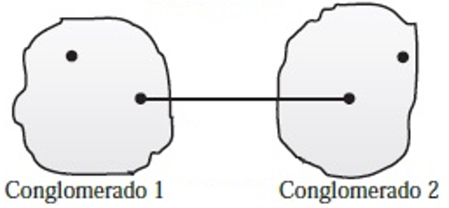
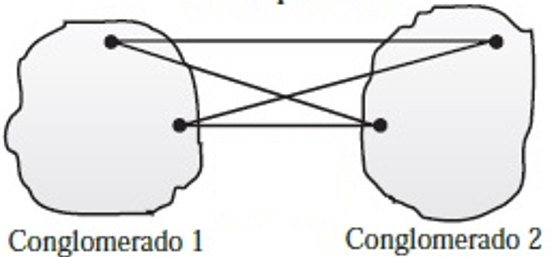
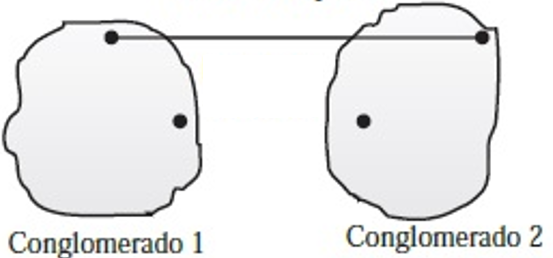

1) Indique que tipo de técnica de aglomeración esta representada por las figuras siguientes:

- Vecino más lejano
- **Vecino más cercano**
- Centroides
- Método de Ward
- Distancia Promedio

- Vecino más lejano
- Vecino más cercano
- Centroides
- Método de Ward
- **Distancia Promedio**

- **Vecino más lejano**
- Vecino más cercano
- Centroides
- Método de Ward
- Distancia Promedio

2) El objetivo del A. Conglomerados es:

  - Buscar principalmente la reducción de variables mediante agrupaciones
  - Encontrar relación entre pares de variables de interés
  - Crear una regla que permita clasificar nuevas observaciones
  - **Construir principalmente agrupaciones de observaciones**
  - B y C son verdaderas

3) Algunas técnicas aglomerativas utilizadas en el análisis jerárquico son:

<ol type="a">
  <li>Vecino más cercano</li>
  <li>Centroide</li>
  <li>Agrupamiento promedio </li>
  <li>Ward</li>  
</ol> 

Respuesta
  - Solo A y B son  verdaderos
  - Ninguna de las aseveraciones es verdadera
  - Solo A, C y D son verdaderas
  - Solo A, B y C son verdaderas
  - **Todas son verdaderas**

4) De forma general, los procedimientos aglomerativos jerárquicos tienen las siguientes fases:

  - Análisis de la matriz de correlación, cálculo de la distancia entre pares, aplicación de un algoritmo de aglomeración y caracterización de los grupos.
  - Análisis de homogeneidad entre grupos, selección de variables, cálculo de la distancia y agrupación de observaciones.
  - **Cálculo de la distancia entre pares, aplicación de un algoritmo de aglomeración y caracterización de los grupos.**
  - Selección de variables discriminantes, selección de método de extracción y formulación de la regla de clasificación.

5) De la siguiente matriz de distancias si se emplea el método de agrupación del vecino más lejano, ¿qué par de objetos deberían formar la primera agrupación?

| Objeto | 1   | 2   | 3   | 4 | 5 |
|--------|-----|-----|-----|---|---|
| 1      | 0   |     |     |   |   |
| 2      | 1   | 0   |     |   |   |
| 3      | 5   | 4.5 | 0   |   |   |
| 4      | 8.5 | 7.8 | 3.6 | 0 |   |
| 5      | 7.2 | 6.7 | 2.2 | 2 | 0 |

  - (4, 5)
  - **(1, 2)***
  - (1, 4)
  - (2, 4) 

* Esto puede parecer contraintuitivo, pero el método del _**vecino más lejano**_ dice: Escoger la menor distancia, de ahí, la mayor. Para el _**vecino más cercano**_, se escoge la menor distancia y de ahí la siguiente menor
